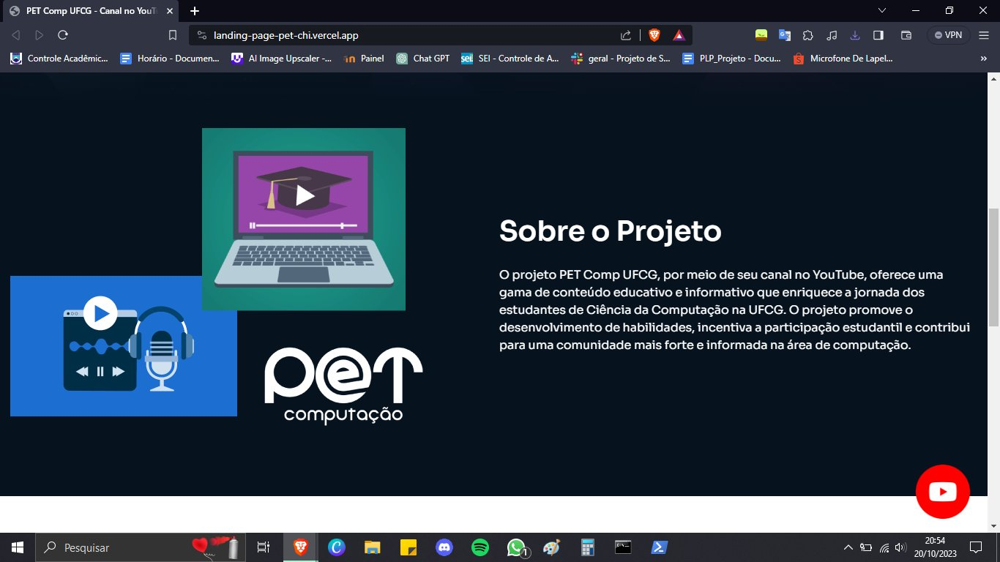
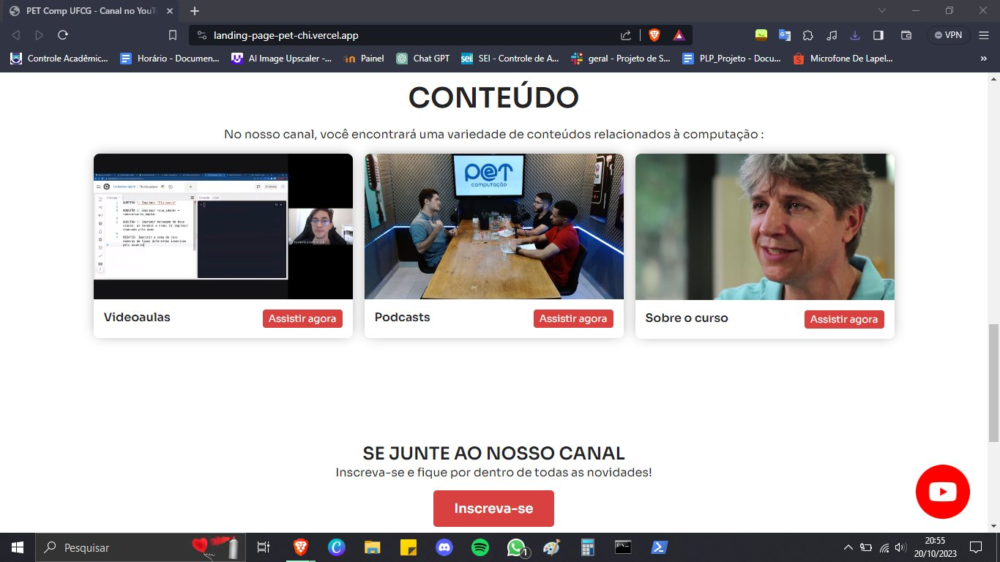

# Landing Page do Canal PET Comp UFCG

👋 Bem-vindo à Landing Page do projeto Canal PET Comp UFCG! Esta página tem como objetivo apresentar e destacar as principais informações sobre o projeto e fornecer acesso fácil ao nosso canal no YouTube.

## Visão Geral

O projeto PET Comp UFCG é uma iniciativa dedicada a oferecer conteúdo educativo e informativo de alta qualidade para os estudantes de Ciência da Computação da Universidade Federal de Campina Grande (UFCG). Nosso canal no YouTube serve como uma plataforma central para acesso a videoaulas, entrevistas com professores, shorts informativos e muito mais.

## Seções Destacadas

### 1. Header
O cabeçalho inclui o logotipo do projeto e links para nossas redes sociais, permitindo uma navegação fácil para visitantes interessados.

### 2. Sobre o Projeto
Esta seção fornece uma visão geral do PET Comp UFCG, incluindo seu propósito, missão e os valores que orientam nosso trabalho. Os visitantes podem aprender mais sobre o que nos motiva e o impacto que desejamos alcançar. Destacamos as vantagens de participar e acessar nosso conteúdo educativo. Isso inclui o aprimoramento de habilidades, o desenvolvimento de uma comunidade de aprendizado e a conexão com outros estudantes apaixonados por Ciência da Computação.

### 3. Conteúdo
Nesta seção, apresentamos informações sobre os tipos de conteúdo oferecidos em nosso canal do YouTube. Isso inclui:

- 📚 **Vídeos Educativos**: Abordamos uma ampla variedade de tópicos, desde programação e desenvolvimento de software até conceitos avançados, proporcionando aos estudantes um recurso valioso para aprimorar suas habilidades.

- 💡 **Dicas e Orientações**: Compartilhamos conselhos práticos e orientações relacionadas à vida acadêmica, oportunidades de estágio e perspectivas de carreira na área de Ciência da Computação.

- 🎙️ **Entrevistas e Eventos**: Mantemos os visitantes atualizados sobre eventos, palestras e entrevistas com profissionais da área, oferecendo uma visão do que está acontecendo no mundo da Ciência da Computação e oportunidades de networking.

### 5. Contato
Fornecemos informações de contato para que os visitantes possam entrar em contato conosco caso tenham perguntas, sugestões ou desejem colaborar conosco. A comunicação aberta é fundamental para construir uma comunidade sólida e bem informada.

## Fique Conectado

- 📺 [Assine o Canal no YouTube](https://www.youtube.com/@grupopetcomputacaoufcg) para receber as últimas atualizações e conteúdo educativo.

- 📷 Siga-nos no [Instagram](https://www.instagram.com/petcomputacaoufcg/) para obter notícias e informações em tempo real.
